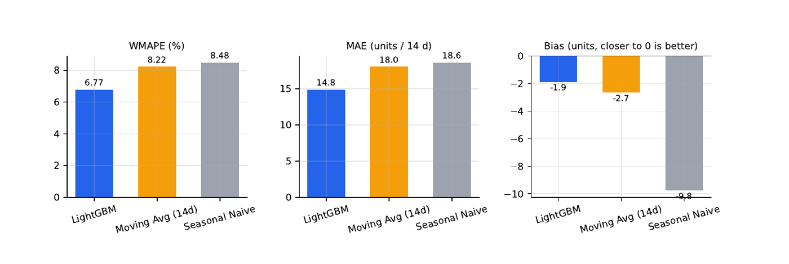
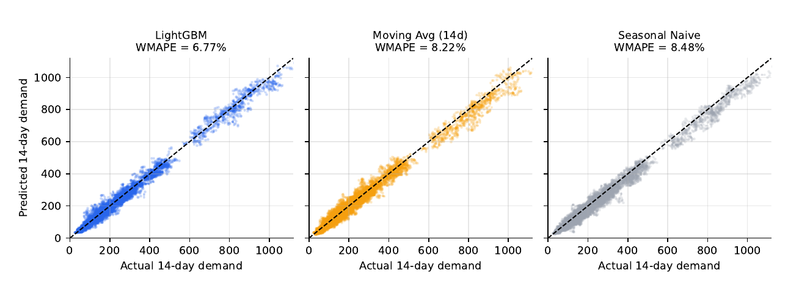
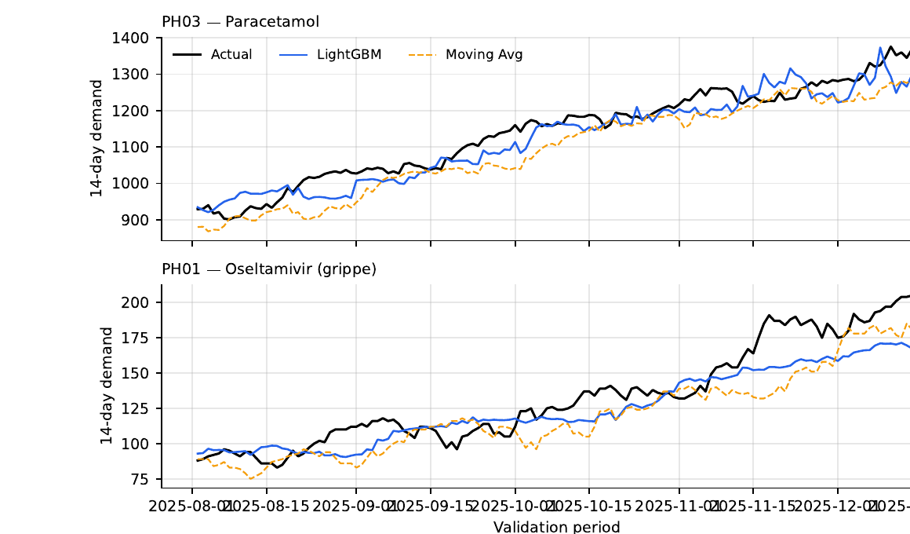
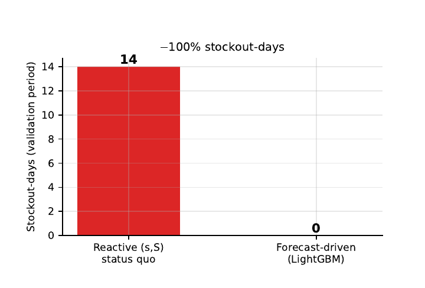
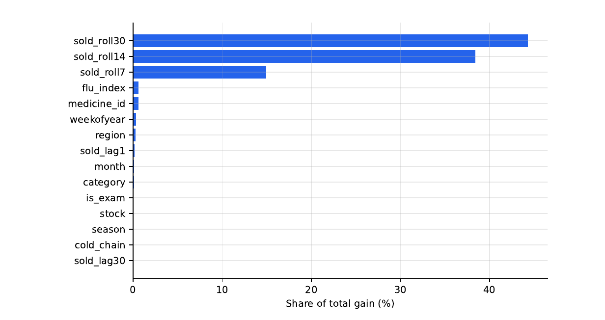
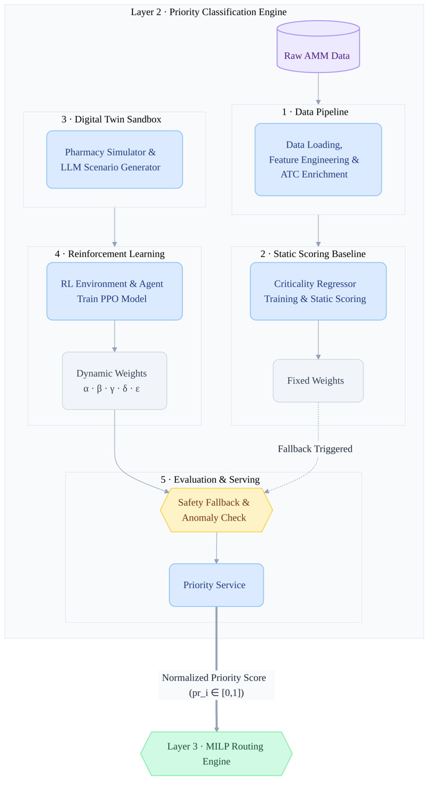
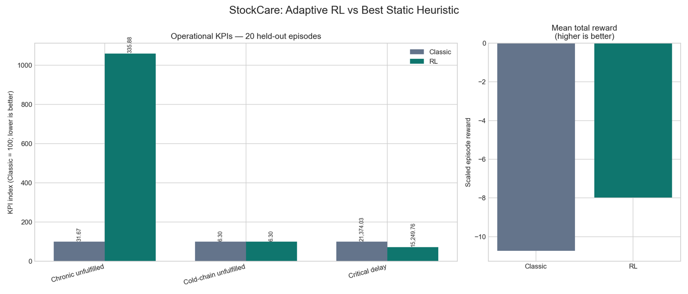
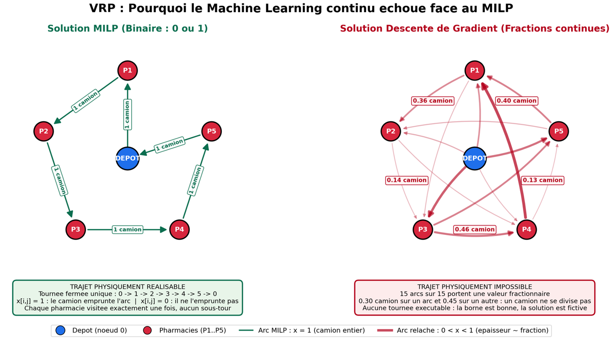
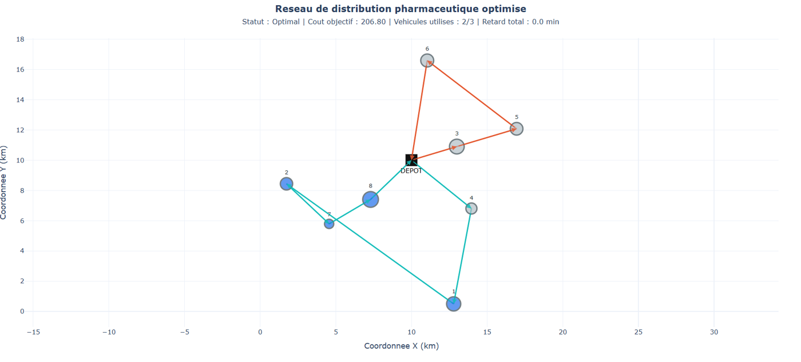

# StockCare: Predictive and Automated Pharmaceutical Distribution

**Team Chaneb+ · Team lead: Omar Amara · Automate or Die hackathon, July 2026**

> **3rd place out of 100 teams** at the **Automate or Die** hackathon (IEEE Tunisia Section, Enactus FPHM, CJD, ATUGE, ATIA). We pitched StockCare in front of government ministers. [See below](#the-hackathon).

StockCare closes the loop between pharmacies and their supply depot. It **detects medicine shortages before they happen**, **drafts the restock request itself**, **ranks every request by clinical priority**, **builds the optimal delivery routes** (respecting the cold chain) and **tracks the trucks in real time**. People only validate: the pharmacist answers *yes / no* to a proposed request, and the depot answers *approve / refuse* to a proposed route.

> *The human approves, the machine decides.*

It is built from three decision engines plus the web platform that ties them together:

| Engine | Question it answers | Method | Folder |
|---|---|---|---|
| **Demand forecasting** | *Which medicine will run out, when, and how much is missing?* | LightGBM (Poisson objective) | [`demand-forecasting/`](demand-forecasting) |
| **Priority engine** | *Which requests matter most?* | Weighted clinical score, weights adapted by a PPO reinforcement-learning agent | [`priority-engine/`](priority-engine) |
| **Route optimization** | *Which truck goes where, in which order, keeping the cold chain?* | Vehicle Routing Problem solved as a MILP (PuLP / CBC) | [`route-optimization/`](route-optimization) |
| Web platform | Workflow, validations, live tracking | Spring Boot 3.3 + Angular 18 + PostgreSQL | [`backend/`](backend), [`frontend/`](frontend) |

**Data room:** [`Data_Room/`](Data_Room): the technical write-up of each engine, the hackathon specification and the datasets.

---

## Contents

1. [The hackathon](#the-hackathon)
2. [How the pieces fit together](#how-the-pieces-fit-together)
3. [Demand forecasting](#1-demand-forecasting)
4. [Priority engine](#2-priority-engine)
5. [Route optimization](#3-route-optimization)
6. [The platform and its workflow](#the-platform-and-its-workflow)
7. [Repository layout](#repository-layout)
8. [Getting started](#getting-started)
9. [Status and limitations](#status-and-limitations)

---

## The hackathon

StockCare was built by **team Chaneb+**, led by **Omar Amara**, for the **Automate or Die** hackathon (July 2026), organized by IEEE Tunisia Section, Enactus FPHM, CJD Tunis Horizon, ATUGE and ATIA.

- **3rd place out of 100 teams**
- Final pitch in front of **government ministers**, partners and the jury

### Team and roles

| Member | Role |
|---|---|
| **Omar Amara** | Team lead: coordinated the team and the pitch, and integrated the three engines into the platform (backend, frontend, Docker setup) |
| **Mohamed Aziz Ncir** | Priority engine: AMM registry pipeline, criticality model, PPO reinforcement-learning agent and scoring API |
| **Adam** | Route optimization: the VRP-MILP solver (cold chain, deadlines, fleet choice) |

<p align="center">
  
</p>

<table>
  <tr>
    <td width="58%"></td>
    <td width="42%"></td>
  </tr>
  <tr>
    <td align="center"><em>Team Chaneb+ on stage after the final pitch.</em></td>
    <td align="center"><em>Presenting the general architecture of StockCare.</em></td>
  </tr>
</table>

---

## How the pieces fit together

```mermaid
flowchart LR
    STOCK["Pharmacy stock<br/>(sales, adjustments)"] --> F["Demand forecasting<br/>LightGBM · :8000"]
    F -->|"shortage ⇒ draft request"| PH{{"Pharmacist<br/>yes / no"}}
    PH -->|yes| P["Priority engine<br/>score 0–1"]
    P --> DEP{{"Depot<br/>approve request"}}
    DEP --> R["Route optimization<br/>VRP-MILP · :8002"]
    R -->|"proposed routes"| DEP2{{"Depot<br/>approve route"}}
    DEP2 --> T["Live tracking (SSE)<br/>pharmacy + depot"]
```



Every arrow is automatic: the backend reacts to events (stock change, simulated time advancing, a "yes", an approval) and calls the next engine by itself.

---

## 1. Demand forecasting

[Full technical write-up](Data_Room/demand_forecasting_overview.pdf)

Pharmacies that reorder only when the shelf is nearly empty run out regularly, because the supplier lead time is longer than what is left on the shelf. This engine replaces that reactive behaviour with an anticipative one.

### What it predicts

For each pharmacy $`i`$, medicine $`m`$ and decision day $`t`$, the model forecasts the total demand over the next $`H = 14`$ days:

```math
D_{i,m}(t) = \sum_{k=1}^{H} d_{i,m}(t+k)
```

That forecast becomes a **shortage gap**, using the current stock $`X`$ and a safety stock $`S`$:

```math
G_{i,m}(t) = \max\left(0,\ \hat{D}_{i,m}(t) + S_{i,m}(t) - X_{i,m}(t)\right)
```

A restock request of $`\lceil G \rceil`$ units is emitted when $`G > \tau`$ ($`\tau = 3`$ units, to avoid tiny orders). The number of days of stock left sets the urgency: ≤ 3 days `CRITICAL`, ≤ 7 `HIGH`, ≤ 14 `NORMAL`, otherwise `LOW`.

### Data and features

The training data is a two-year daily panel (digital twin) of 8 pharmacies across Tunisian governorates and 15 medicines. It reproduces the real problem: stock follows a reactive $`(s, S)`$ policy, sales are censored ($`\text{sold} = \min(\text{demand}, \text{stock})`$), and demand reacts to exam periods, heatwaves and a winter flu index:

```math
\text{flu}(t) = \tfrac{1}{2}\left(1 + \cos\frac{2\pi\,\text{doy}(t)}{365.25}\right) \in [0, 1]
```

Features (all shifted by at least one day, so nothing looks into the future): sales lags (1, 7, 14, 30 days), rolling means (7, 14, 30 days), 14-day stockout pressure, current stock, exam / heatwave / flu signals, calendar (day of week, month, ISO week, season) and categoricals (region, medicine category, medicine id, cold chain).

### Model

Gradient-boosted trees: each new tree $`f_k`$ corrects the errors of the ensemble built so far, with learning rate $`\eta = 0.05`$:

```math
\hat{F}_K(x) = \hat{F}_0 + \eta \sum_{k=1}^{K} f_k(x), \qquad f_k = \arg\min_f \sum_n L\left(y_n,\ \hat{F}_{k-1}(x_n) + f(x_n)\right)
```

Demand is a non-negative count, so the loss is the **Poisson** negative log-likelihood (predictions are positive by construction):

```math
L(y, \mu) = \mu - y \log \mu, \qquad \mu(x) = e^{F(x)}
```

LightGBM settings: `num_leaves = 63`, `min_data_in_leaf = 100`, feature/bagging fractions 0.8, early stopping (patience 60). A pure-NumPy histogram GBT is used automatically if LightGBM is not available. Validation is a strict **time split**: the last 20 % of the timeline (after 2025-08-01) is held out.

### Results (out-of-sample)

The model has to beat two baselines a pharmacist could compute by hand: a 14-day moving average and a seasonal naïve forecast (same weekday one year earlier).

```math
\text{WMAPE} = \frac{\sum_n |y_n - \hat{y}_n|}{\sum_n |y_n|} \qquad \text{MAE} = \frac{1}{N}\sum_n |y_n - \hat{y}_n| \qquad \text{Bias} = \frac{1}{N}\sum_n (\hat{y}_n - y_n)
```

| Model | WMAPE | MAE (units / 14 days) | Bias (units) |
|---|---|---|---|
| **LightGBM (Poisson)** | **6.77 %** | **14.8** | **−1.9** |
| Moving average (14 days) | 8.22 % | 18.0 | −2.7 |
| Seasonal naïve | 8.48 % | 18.6 | −9.8 |

LightGBM cuts the error by **17.6 %** compared with the best baseline.

<p align="center">
  
</p>

<table>
  <tr>
    <td></td>
    <td></td>
  </tr>
  <tr>
    <td align="center"><em>Predicted vs. actual 14-day demand: LightGBM stays on the diagonal.</em></td>
    <td align="center"><em>Over time, LightGBM follows the rises as they start; the moving average lags behind, and that lag is what causes stockouts.</em></td>
  </tr>
</table>

**Business impact.** When the validation period is replayed with ordering driven by the forecast (3-day delivery lead time) instead of the reactive policy, **stockout-days drop from 14 to 0**.

<table>
  <tr>
    <td width="40%"></td>
    <td width="60%"></td>
  </tr>
  <tr>
    <td align="center"><em>Simulated stockout-days.</em></td>
    <td align="center"><em>Feature importance: the model relies mostly on recent sales levels.</em></td>
  </tr>
</table>

**Service:** FastAPI on port 8000. `POST /predict` returns, for each medicine, the predicted shortage date, the days left, the missing quantity, the demand forecast and the urgency.

---

## 2. Priority engine

[Full technical write-up](Data_Room/priority_engine_overview.pdf)

When depot capacity is scarce, this engine decides which requests go first. It turns the Tunisian medicine registry (DPM AMM: 6,058 products, 1,088 active ingredients, or DCI) into a normalized priority score.

### The score

For pharmacy $`i`$ and medicine $`m`$:

```math
\text{priority}(i, m) = \mathrm{clip}_{[0,1]}\Big( w_0\,\text{criticality}(m) + w_1\,\text{stockout\_risk}(i,m) + w_2\,\text{irreplaceability}(m) + w_3\,\text{cold\_chain}(m) + w_4\,\text{population\_impact}(i,m) + w_5\,\text{made\_in\_tunisia}(m) \Big)
```

| Factor | Meaning | Source |
|---|---|---|
| criticality | Clinical importance, 0 to 1 | Pharmacist annotations, and a LightGBM regressor for the DCIs nobody annotated |
| stockout_risk | Live shortage risk at this pharmacy | Demand forecasting engine |
| irreplaceability | Inverse of the number of substitutes (same DCI, same dose) | AMM registry |
| cold_chain | Needs refrigerated transport | DCI, form and product-type rules |
| population_impact | Local demand / population weight | Demand forecasting engine |
| made_in_tunisia | Share of the DCI's products made locally | AMM registry |

### Adaptive weights with reinforcement learning

The weights $`w`$ are not fixed. A **PPO agent** (Stable-Baselines3) observes a 7-number context (stockout rates per medicine class, seasonality, import-disruption and epidemic flags) and outputs bounded changes to the weight logits. A softmax turns the logits into weights that are positive and sum to 1:

```math
w = \mathrm{softmax}(\ell + \Delta\ell), \qquad \sum_k w_k = 1
```

It is trained for 30,000 steps in a deliberately scarce simulator: 20 pharmacies, 60 medicines, 26-week episodes, random epidemics and import disruptions. Its reward penalizes unmet chronic demand, unmet cold-chain demand (the heaviest penalty), critical delays and overstock.

**Safety:** if the model fails, returns `NaN`, or gives any weight above 0.85, the service falls back to fixed weights $`[0.55, 0.15, 0.10, 0.10, 0.05, 0.05]`$, and the response says so (`fallback_used: true`).

<table>
  <tr>
    <td width="38%"></td>
    <td width="62%"></td>
  </tr>
  <tr>
    <td align="center"><em>Architecture of the priority engine.</em></td>
    <td align="center"><em>Adaptive RL vs. the best static weights, 20 held-out episodes.</em></td>
  </tr>
</table>

### Results (simulator, 20 held-out episodes)

| KPI | Static weights | PPO | Change |
|---|---|---|---|
| Total reward | −10.73 | −7.97 | **+25.7 %** |
| Critical delay | 21,374 | 15,250 | **−28.7 %** |
| Cold-chain unmet demand | 6.30 | 6.30 | 0 % |
| Chronic unmet demand | 31.67 | 335.88 | worse |

PPO improves the overall reward and critical delays, but the saved policy serves chronic demand much worse. That trade-off is reported as-is: it shows where the reward design still needs work. These are simulator results, not a real-world benchmark.

**Service:** FastAPI. `POST /context` updates the depot context, `GET /weights` returns the current weights, and `POST /priority-scores` scores a batch of requests.

---

## 3. Route optimization

[Full technical write-up](Data_Room/route_optimization_overview.pdf)

Once requests are approved, the depot sends **all approved requests and the whole active fleet in a single solve**. The model chooses which trucks to use, which pharmacies each truck serves, and in which order. Nobody picks a truck by hand.

### Model: VRP as a Mixed-Integer Linear Program

**Sets:** nodes $`N = \{0, 1, \dots, n\}`$ (0 is the depot), pharmacies $`C = N \setminus \{0\}`$, vehicles $`K`$.

**Decision variables:**

- $`x_{ijk} \in \{0,1\}`$: vehicle $`k`$ drives from $`i`$ to $`j`$
- $`z_k \in \{0,1\}`$: vehicle $`k`$ is used
- $`s_i \in [0, H_{max}]`$: arrival time at node $`i`$ (minutes)
- $`L_i \ge 0`$: lateness at node $`i`$ beyond its deadline

**Objective:** transport cost + priority-weighted lateness + priority-weighted arrival time + fixed cost per truck used.

```math
\min\ \sum_{i,j,k} c_k\, d_{ij}\, x_{ijk} \;+\; w_p \sum_{i \in C} pr_i\, L_i \;+\; \gamma \sum_{i \in C} pr_i\, s_i \;+\; w_v \sum_{k} z_k
```

**Constraints:**

| # | Constraint | Equation |
|---|---|---|
| 1 | Every pharmacy is served exactly once | $`\sum_{k}\sum_{i \neq j} x_{ijk} = 1 \quad \forall j \in C`$ |
| 2 | Flow conservation: a truck that enters a node leaves it | $`\sum_{j} x_{jik} = \sum_{j} x_{ijk} \quad \forall i \in C, k`$ |
| 3 | A used truck leaves and returns to the depot | $`\sum_{j \in C} x_{0jk} = \sum_{j \in C} x_{j0k} = z_k`$ |
| 4 | Capacity | $`\sum_{i}\sum_{j \in C} q_j\, x_{ijk} \le Q_k\, z_k`$ |
| 5 | **Cold chain**: a cold-chain order only rides a refrigerated truck | $`x_{ijk} = 0 \quad \text{if } cc_j = 1 \text{ and } R_k = 0`$ |
| 6 | Time propagation, which also removes subtours (Big-M) | $`s_j \ge s_i + \sigma_i + t_{ij} - M_{ij}(1 - x_{ijk})`$, with $`M_{ij} = H_{max} + \sigma_i + t_{ij}`$ |
| 7 | Lateness against the deadline | $`L_i \ge s_i - T_i`$ |
| 8 | The clock starts at the depot | $`s_0 = 0`$ |

### How the inputs are derived

- **Priority** $`pr_i`$ of a stop = the **max** priority among its order lines: the most critical medicine sets the urgency.
- **Deadline** $`T_i`$: linear interpolation from the priority, between $`pr = 0.66 \rightarrow 45`$ min and $`pr = 0.06 \rightarrow 210`$ min. Cold chain tightens it by 15 min, with a 30 min floor.
- **Unloading time** $`\sigma_i = \min(25,\ 3 + 0.8 \times \text{lines})`$ minutes.
- **Distance and time:** haversine distance × road sinuosity, divided by speed, in three tiers. Under 15 km: 1.6 and 20.9 km/h, calibrated on 13 real TomTom trips in Sousse. Up to 60 km: 1.35 and 55 km/h. Beyond: 1.2 and 85 km/h.
- **Parameters:** $`w_p = 5`$, $`\gamma = 0.1`$, $`w_v = 50`$, $`H_{max} = 480`$ min, cost 1.10 TND/km (1.75 refrigerated), 60 s solver time limit.

### Why an exact MILP

A continuous relaxation (or a gradient method) returns fractions of trucks, like "send 0.36 truck this way". Rounding them back loses about 18 % of the objective in our comparison (score 371 vs. 451 for the exact MILP). The MILP makes clean 0/1 decisions from the start.

<table>
  <tr>
    <td></td>
    <td></td>
  </tr>
  <tr>
    <td align="center"><em>MILP (one whole truck per arc) vs. continuous relaxation (fractions of trucks).</em></td>
    <td align="center"><em>Optimal solution on a real network: only 2 of the 3 trucks are needed, and total lateness is 0 min.</em></td>
  </tr>
</table>

**Failure policy: loud.** If the solver fails, planning stops and the depot sees it: a wrong route is worse than no route. Requests stay approved and go into the next solve.

**Structure:** `route-optimization/milp_solver/` is the solver (model, catalogue, demand aggregation, geometry, scenarios). `route-optimization/api/` is the FastAPI wrapper used by the platform (`POST /optimize`, port 8002).

---

## The platform and its workflow

| Event | Triggered by | Automatic action |
|---|---|---|
| `InventoryChanged` | any stock write | re-run the forecast for that pharmacy |
| `SimulatedTimeChanged` | simulated clock moves forward | re-run the forecast for **all** pharmacies |
| `ShortagePredicted` | forecasting engine | draft the restock request (medicine, quantity = predicted gap, urgency) |
| `RequestSubmitted` | pharmacist says "yes" | compute the priority |
| `RequestApprovedForPlanning` | depot approves | fleet-wide MILP solve of all approved requests (one solve per depot; new approvals re-plan pending proposals, never trucks already on the road) |

- **Backend:** Spring Boot 3.3 / Java 21, PostgreSQL 16 + Flyway, JWT, server-sent events for live updates, GPS simulator (2 s tick).
- **Frontend:** Angular 18 + Tailwind + Leaflet maps, with separate pharmacy and depot interfaces.

---

## Repository layout

```
.
├── demand-forecasting/      # Python · LightGBM forecasting service (:8000)
│   ├── data/ features/ models/ eval/ shortage/
│   ├── artifacts/           # trained model, panel, metrics
│   ├── docs/                # technical report (LaTeX + PDF) and figures
│   └── tests/
├── priority-engine/         # Python · AMM pipeline, criticality model, PPO agent, scoring API
│   ├── src/ data/ models/ docs/
├── route-optimization/
│   ├── milp_solver/         # VRP-MILP (PuLP/CBC): config, data, src, scenarios, tests
│   └── api/                 # FastAPI wrapper used by the platform (:8002)
├── backend/                 # Spring Boot workflow, API, SSE, GPS simulator (:8080)
├── frontend/                # Angular 18 UI (:4200)
├── Data_Room/               # write-ups of the three engines, specs, datasets
├── docs/images/             # figures used in this README
└── docker-compose.yml
```

**Data room contents:** the technical write-up of each engine (`demand_forecasting_overview.pdf`, `priority_engine_overview.pdf`, `route_optimization_overview.pdf`), the hackathon specification and our own specification (`cahier_de_charge_hackathon.pdf`, `chaneb_plus_cahier_des_charges.pdf`), the AMM medicine registry, delivery priorities, the list of potential customers, and fuel price / CO₂ data.

---

## Getting started

```bash
cp .env.example .env
docker compose up --build        # db + backend + frontend + forecasting + routing
# optional: docker compose --profile tools up --build   (adds Adminer on :8081)
```

- **UI:** http://localhost:4200 · **API:** http://localhost:8080 · **Swagger:** http://localhost:8080/swagger-ui.html
- Seeded accounts (password `Password123!`): `depot@stockcare.tn` (depot), plus pharmacies `ph.tunis@`, `ph.ariana@`, `ph.nabeul@`, `ph.sousse@`, `ph.sfax@`, `ph.marsa@`, `ph.benarous@`, `ph.hammamet@stockcare.tn`.

Everything runs locally: no external API and no key required.

**Running an engine on its own:**

```bash
# Demand forecasting: train, evaluate, regenerate the figures, run the tests
cd demand-forecasting && pip install -r requirements.txt && python run.py && pytest

# Route optimization: solver demo + tests, then the API tests
cd route-optimization/milp_solver && pip install -r requirements.txt && python run.py && pytest
cd ../api && pip install -r requirements.txt && pytest

# Priority engine: scoring API
cd priority-engine && pip install -r requirements.txt
uvicorn src.api.priority_service:app --port 8001
```

---

## Status and limitations

- Tests pass: demand forecasting (45), MILP solver (53), routing API (17).
- Real end-to-end routing: refrigerated truck chosen for cold-chain orders, stops ordered by priority and deadline, pharmacies up to Sfax (235 km) routable thanks to the distance tiers.
- **The priority engine is not plugged into the platform yet.** The backend currently computes priority with a fixed weighted formula behind the same interface (`PriorityCalculationService`). The PPO service is ready to replace it in `external` mode.
- All forecasting and priority results come from simulated data (digital twin), not from real pharmacy transactions.
- GPS tracking is simulated (interpolation along the route).
- Deadlines are calibrated for urban distances; long national trips are routable but show honest lateness.

The priority engine was developed in [`mohamedazizncir/layer2_hackathon`](https://github.com/mohamedazizncir/layer2_hackathon) and is included here so that the whole system lives in one repository.
