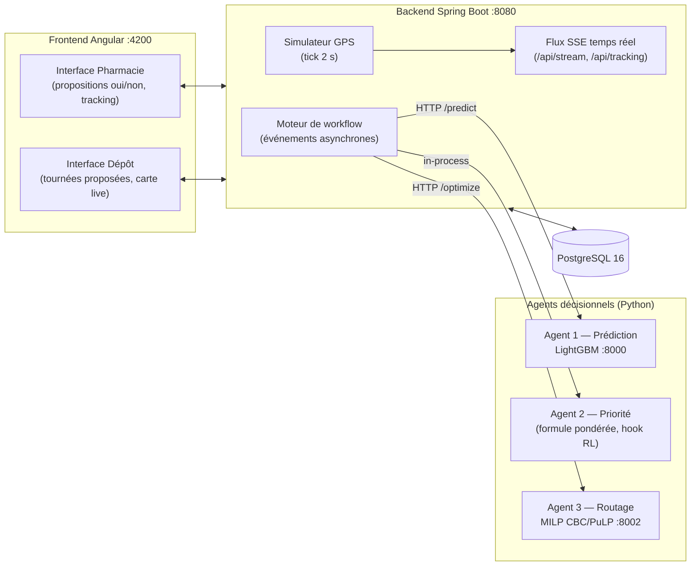
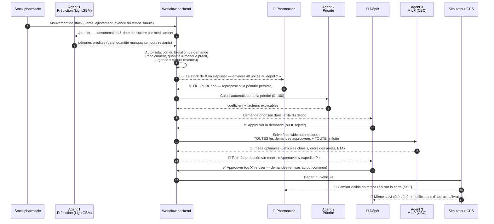
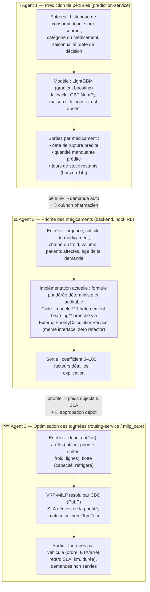
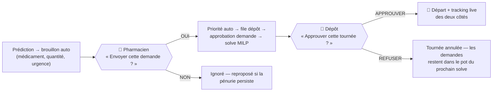

# StockCare — Réseau de distribution pharmaceutique prédictif et automatisé

**Team Chaneb+** · Prédiction de pénuries → Priorisation des médicaments → Optimisation MILP des tournées → Suivi temps réel.

StockCare ferme la boucle complète entre les pharmacies et le dépôt : le système **détecte les pénuries avant qu'elles n'arrivent**, **rédige lui-même les demandes**, **calcule la priorité de chaque médicament**, **construit les tournées optimales de livraison** et **suit les véhicules en temps réel**. Aucun humain ne prend de décision opérationnelle : les deux seules interactions humaines du système sont des validations **oui / non**.

> **Philosophie du workflow** : *l'humain approuve, la machine décide.*
> - Le pharmacien ne choisit ni le médicament, ni la quantité, ni l'urgence → il répond **oui/non** à une proposition.
> - Le dépôt ne choisit ni le véhicule, ni l'ordre des arrêts, ni l'affectation → il répond **approuver/refuser** à une tournée proposée par le MILP.

---

## 1. Vue d'ensemble de l'architecture



| Service | Port | Rôle |
|---|---|---|
| `frontend` | 4200 | Angular 18 + Tailwind + Leaflet (cartes live) |
| `backend` | 8080 | Spring Boot 3.3 / Java 21 — workflow, API, SSE, simulateur GPS |
| `prediction-service` | 8000 | Python — LightGBM (fallback GBT NumPy) pour la prévision de demande |
| `routing-service` | 8002 | Python — enveloppe FastAPI autour du solveur **milp_care** (VRP-MILP, CBC) |
| `db` | 5432 | PostgreSQL 16 + Flyway |
| `adminer` (optionnel) | 8081 | Console SQL (`--profile tools`) |

---

## 2. Le workflow exact, de bout en bout

Chaîne complète : **8 étapes automatiques, 2 validations humaines.**



Détail des déclencheurs automatiques (événements Spring, asynchrones, après commit) :

| Événement | Déclenché par | Action automatique |
|---|---|---|
| `InventoryChanged` | toute écriture de stock | relance la prédiction de la pharmacie |
| `SimulatedTimeChanged` | horloge simulée avancée | relance la prédiction de **toutes** les pharmacies |
| `ShortagePredicted` | l'agent de prédiction | auto-rédige les brouillons de demande (anti-doublon par médicament) |
| `RequestSubmitted` | le « oui » du pharmacien | calcul automatique de la priorité |
| `RequestApprovedForPlanning` | le « approuver » du dépôt | **solve MILP fleet-wide** de tout l'arriéré approuvé du dépôt (verrou par dépôt, les vagues d'approbations fusionnent en un seul solve) |

---

## 3. Les trois agents décisionnels



### 3.1 Agent 1 — Prédiction (LightGBM)

- Prévision de la demande par médicament et par pharmacie sur un **horizon de 14 jours**.
- Projette l'épuisement du stock courant → `date de rupture`, `quantité manquante`, `jours restants`.
- Se déclenche **sans action humaine** : à chaque mouvement de stock et à chaque avancée du temps simulé.
- La pénurie prédite fixe automatiquement l'**urgence** du brouillon :

| Jours de stock restants | Urgence |
|---|---|
| ≤ 3 | `CRITICAL` |
| ≤ 7 | `HIGH` |
| ≤ 14 | `NORMAL` |
| > 14 | `LOW` |

### 3.2 Agent 2 — Priorité (formule pondérée → RL)

Coefficient 0–100 calculé automatiquement dès que le pharmacien dit « oui ». Implémentation actuelle (déterministe, chaque facteur est exposé dans l'UI pour l'auditabilité) :

| Facteur | Poids | Normalisation |
|---|---|---|
| Urgence de la demande | 0,30 | LOW→0 … CRITICAL→1 |
| Criticité du médicament | 0,25 | score catalogue 0–1 |
| Chaîne du froid | 0,15 | binaire |
| Volume demandé | 0,10 | min(1, qté/100) |
| Patients affectés | 0,10 | min(1, patients/50) |
| Âge de la demande | 0,10 | min(1, heures/72) |

Le modèle **RL** (apprentissage par renforcement) est prévu pour remplacer cette formule : il se branche derrière la même interface (`PriorityCalculationService`, mode `external`) sans toucher au workflow. **Important** : quand le modèle RL émettra des coefficients 0–1, mettre `priorite.echelle_entree = 1.0` dans `routing-service/config.json` (actuellement `100.0` pour l'échelle 0–100 du backend).

### 3.3 Agent 3 — MILP de routage (milp_care, importé tel quel)

Le backend envoie **toutes les demandes approuvées et toute la flotte active en un seul solve** : le MILP choisit lui-même quels véhicules activer, quelles pharmacies affecter à quel véhicule, et dans quel ordre. Personne ne choisit un camion à la main.

**Fonction objectif minimisée :**

```
min   Σ coût_km(k)·d(i,j)·x(i,j,k)     — coût de transport (1,10 DT/km, 1,75 réfrigéré)
    + w_p · Σ pr(i)·L(i)               — retard SLA pondéré par la priorité   (w_p = 5,0)
    + γ   · Σ pr(i)·s(i)               — heure d'arrivée pondérée (réactivité) (γ = 0,1)
    + w_v · Σ z(k)                     — coût fixe d'activation d'un véhicule  (w_v = 50)
```

**Contraintes :** chaque arrêt servi exactement une fois · conservation des flux · départ/retour dépôt par véhicule actif · capacité par véhicule · propagation temporelle (arrivée + déchargement + trajet) · retard `L(i) ≥ s(i) − T(i)` · chaîne du froid ⇒ véhicule réfrigéré obligatoire · durée max de tournée `H_max = 480 min` · time limit solveur 60 s.

**Paramètres dérivés automatiquement (`routing-service/config.json`) :**

| Bloc | Paramètre | Valeur | Signification |
|---|---|---|---|
| `priorite` | `echelle_entree` | 100.0 | le coefficient backend 0–100 est ramené à 0–1 |
| `sla` | interpolation | pr 0,66→45 min · pr 0,06→210 min | plus prioritaire ⇒ deadline `T(i)` plus serrée |
| `sla` | `bonus_chaine_froid_min` | −15 min | le froid resserre encore la deadline (plancher 30 min) |
| `dechargement` | σ(i) | 3 min + 0,8 min/ligne (max 25) | temps de service par arrêt |
| `geometrie` | sinuosité · vitesse | 1,6 · 20,9 km/h | distances Haversine calibrées sur 13 trajets TomTom réels (Sousse, 18/07/2026) |
| `flotte` | coût/km | 1,10 / 1,75 | véhicule standard / réfrigéré |

**Politique d'échec : bruyante.** Contrairement à la prédiction (dégradée silencieusement en cas de panne), un échec du solveur **bloque la planification et s'affiche au dépôt** — une mauvaise tournée est pire que pas de tournée. Les demandes restent approuvées et repartent au prochain solve.

---

## 4. Les deux seuls points de décision humains



*(L'approbation de la demande côté dépôt est elle aussi un simple approuver/rejeter — la priorité est déjà calculée à son arrivée.)*

---

## 5. Démarrage rapide

```bash
cp .env.example .env
docker compose up --build          # db + backend + frontend + 2 services Python
# option : docker compose --profile tools up --build   (ajoute Adminer :8081)
```

- **UI :** http://localhost:4200 · **API :** http://localhost:8080 · **Swagger :** http://localhost:8080/swagger-ui.html
- Comptes seed : `ph.tunis@stockcare.tn` (pharmacie) · `depot@stockcare.tn` (dépôt) · mot de passe `Password123!`

**Scénario de démonstration (2 minutes) :**
1. Connecté **pharmacie** : baisser un stock (ou avancer l'horloge simulée) → une carte « Proposé pour vous » apparaît → **Oui, envoyer au dépôt**.
2. Connecté **dépôt** : la demande arrive déjà priorisée → **Approuver** → bannière « MILP optimizer running » → carte de tournée proposée (véhicule choisi par le solveur, arrêts ordonnés, km, ETA) → **Approuver & expédier**.
3. Le camion se déplace en direct sur la carte du dépôt **et** de la pharmacie (SSE, notifications d'approche et de livraison automatiques).

Tout tourne en local : aucune API externe, aucune clé requise.

### Variables d'environnement clés (voir `.env.example`)

| Variable | Défaut compose | Rôle |
|---|---|---|
| `STOCKCARE_MODEL_PREDICTION_MODE` | `external` | LightGBM réel (fallback silencieux si service injoignable) |
| `STOCKCARE_MODEL_ROUTE_MODE` | `external` | MILP réel (échec **bruyant** si injoignable) |
| `STOCKCARE_WORKFLOW_AUTO_ROUTE` | `true` | approbation ⇒ solve MILP automatique |
| `STOCKCARE_WORKFLOW_SHORTAGE_ACTION` | `draft` | pénurie prédite ⇒ brouillon automatique |
| `STOCKCARE_WORKFLOW_AUTO_SUBMIT` | `false` | `true` = saute même le oui/non du pharmacien |
| `STOCKCARE_ROUTING_TIMEOUT_MS` | `90000` | budget du solve MILP côté backend |

---

## 6. Structure du dépôt

```
backend/               Spring Boot 3.3 (Java 21) — workflow, API, SSE, simulateur GPS
frontend/              Angular 18 + Tailwind + Leaflet
prediction-service/    Python — LightGBM / GBT NumPy (:8000)
routing-service/       Python — FastAPI autour de milp_care (:8002), config.json = tous les réglages solveur
milp_care/             Solveur VRP-MILP d'origine (importé NON MODIFIÉ via milp_path.py)
docker-compose.yml     Orchestration complète (le build du routing-service se fait depuis la racine :
                       l'image a besoin de routing-service/ ET de milp_care/)
```

## 7. État actuel & limitations connues

- ✅ Routing-service : 16 tests verts ; solve réel vérifié de bout en bout (choix du véhicule réfrigéré pour la chaîne du froid, ordre par priorité/SLA).
- ✅ Frontend : build de production vérifié.
- ⚠️ Le backend Java n'a pas encore été compilé dans un environnement avec JDK/Maven — le premier `docker compose up --build` peut révéler des erreurs de compilation ou la validation Hibernate des requêtes HQL au démarrage (elles ne se voient qu'au boot).
- ⚠️ L'agent Priorité est la formule pondérée décrite en §3.2 — le modèle RL est un branchement futur derrière la même interface.
- Le tracking GPS est simulé (interpolation le long de la polyline de la tournée, tick 2 s) — remplaçable par un vrai flux GPS derrière `TrackingBroadcaster`.
